# Hotel Booking Application - User Service Flow Chart

## 1. Application Startup Flow

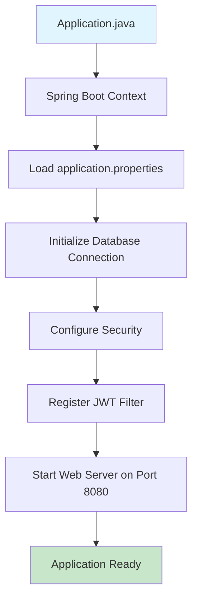

## 2. User Registration Flow

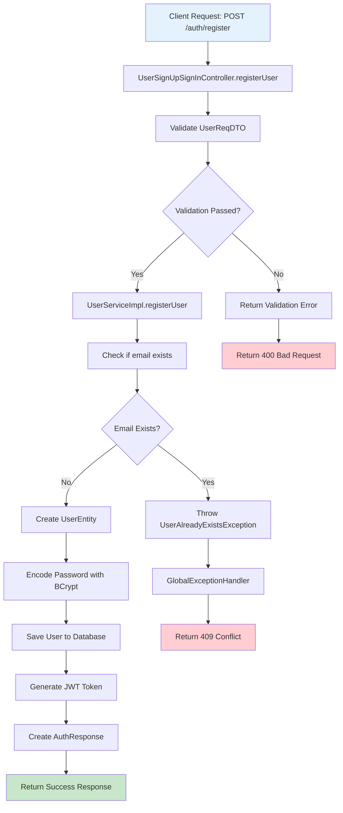

## 3. User Login Flow

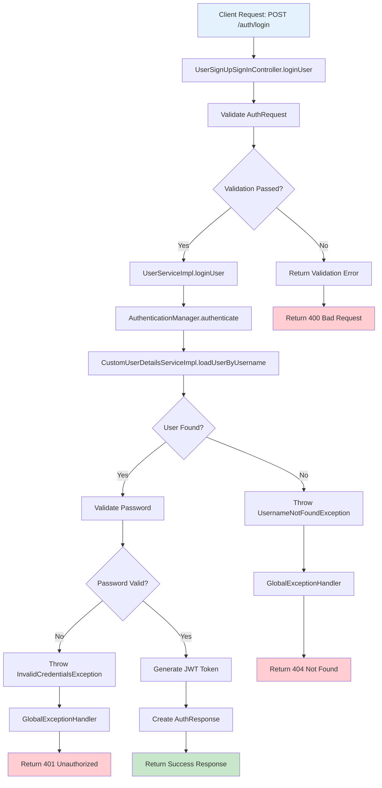

## 4. JWT Authentication Flow

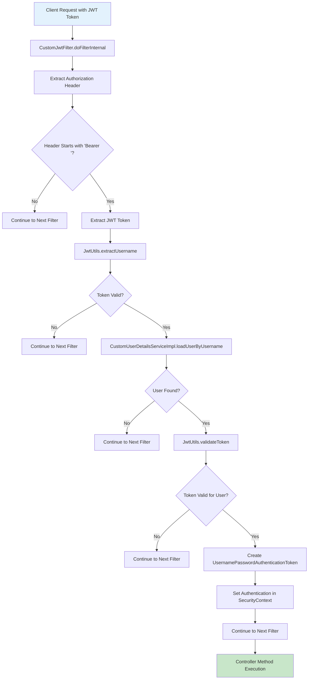

## 5. Protected Endpoint Access Flow

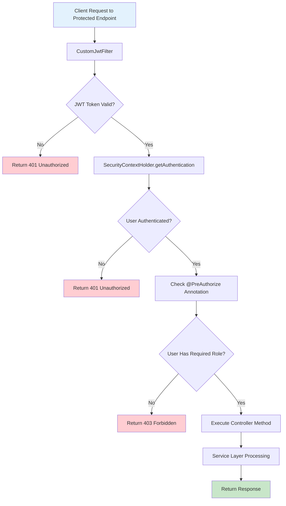

## 6. User Profile Retrieval Flow

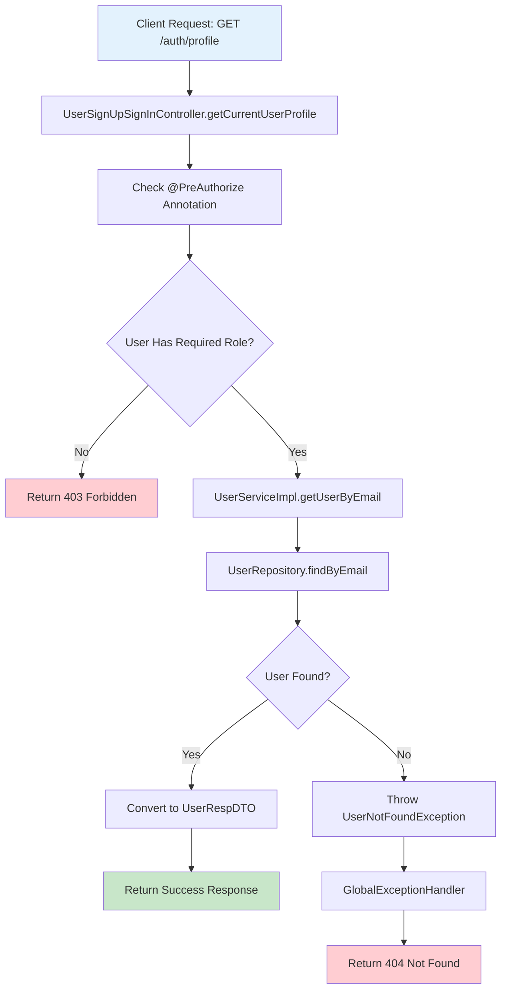

## 7. Admin User Management Flow

```mermaid
flowchart TD
    A[Admin Request: GET /auth/users] --> B[UserSignUpSignInController.getAllUsers]
    B --> C[Check @PreAuthorize hasRole('ADMIN')]
    C --> D{User is ADMIN?}
    D -->|No| E[Return 403 Forbidden]
    D -->|Yes| F[UserServiceImpl.getAllUsers]
    F --> G[UserRepository.findAll]
    G --> H[Convert List<UserEntity> to List<UserRespDTO>]
    H --> I[Return Success Response]
    
    A2[Admin Request: PUT /auth/users/{id}] --> B2[UserSignUpSignInController.updateUser]
    B2 --> C2[Check @PreAuthorize hasRole('ADMIN')]
    C2 --> D2{User is ADMIN?}
    D2 -->|No| E2[Return 403 Forbidden]
    D2 -->|Yes| F2[UserServiceImpl.updateUser]
    F2 --> G2[UserRepository.findById]
    G2 --> H2{User Found?}
    H2 -->|No| I2[Throw UserNotFoundException]
    H2 -->|Yes| J2[Update User Fields]
    J2 --> K2[UserRepository.save]
    K2 --> L2[Convert to UserRespDTO]
    L2 --> M2[Return Success Response]
    
    I2 --> N2[GlobalExceptionHandler]
    N2 --> O2[Return 404 Not Found]
    
    style A fill:#e3f2fd
    style A2 fill:#e3f2fd
    style I fill:#c8e6c9
    style M2 fill:#c8e6c9
    style E fill:#ffcdd2
    style E2 fill:#ffcdd2
    style O2 fill:#ffcdd2
```

## 8. Password Change Flow

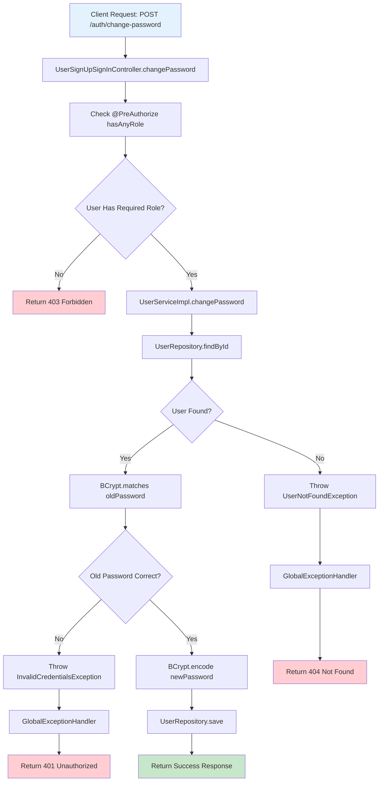

## 9. Exception Handling Flow

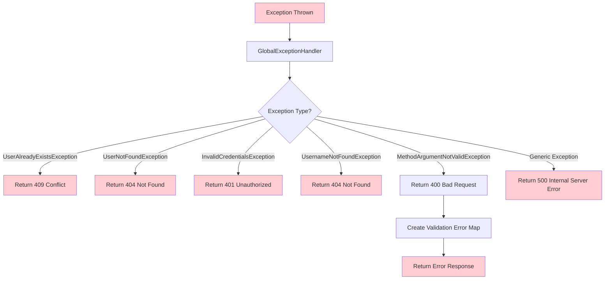

## 10. Database Operations Flow

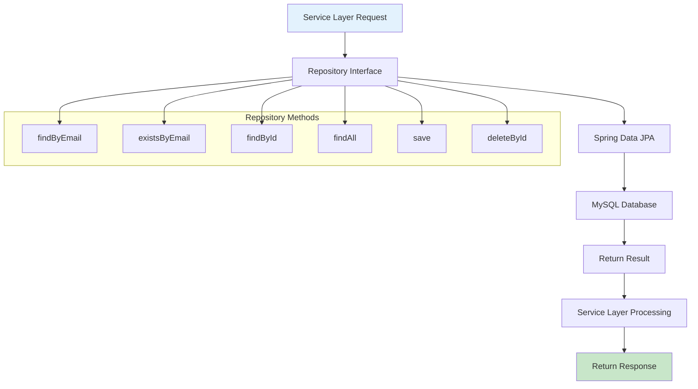

## 11. Security Configuration Flow

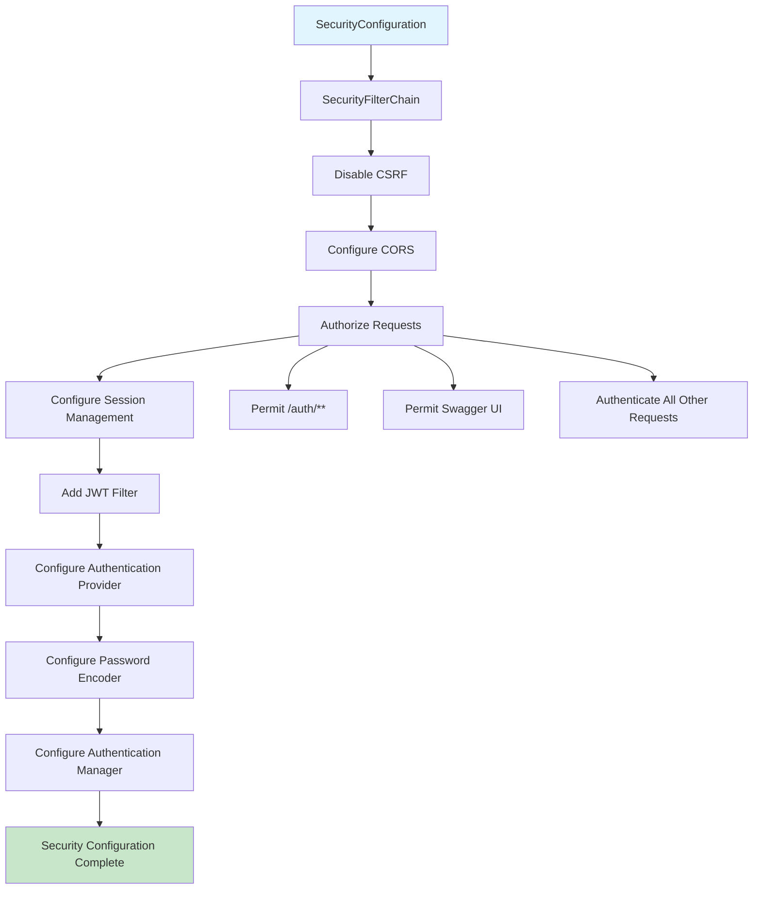

## 12. Complete Request-Response Flow

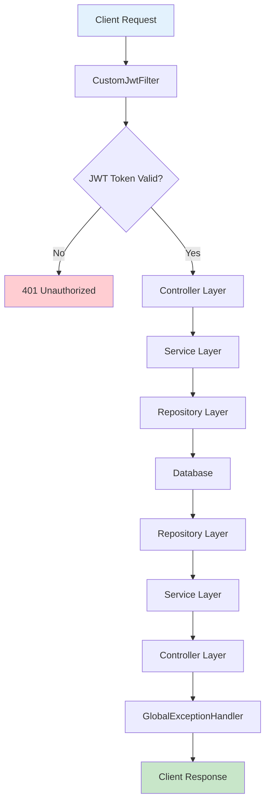

## Color Legend

- 🔵 **Blue**: Input/Start points
- 🟢 **Green**: Success/End points  
- 🔴 **Red**: Error/Exception paths
- 🟡 **Yellow**: Processing/Decision points

## Key Components

1. **Controllers**: Handle HTTP requests and responses
2. **Services**: Business logic implementation
3. **Repositories**: Data access layer
4. **Security**: JWT authentication and authorization
5. **Exception Handling**: Centralized error management
6. **Validation**: Input validation and error handling

This flow chart provides a comprehensive view of how the Hotel Booking Application User Service handles authentication, authorization, and user management operations with JWT security.